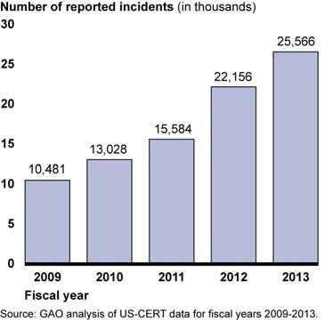

Title: When Bar Graphs Go Awry
Date: 2014-04-08 22:34:29
Category: blog
Status: draft
Tags: blog
Slug: when-bar-graphs-go-awry
Author: Bob Rudis (@hrbrmstr)

The US Government Accountability Office (GAO) release a report on April 2, 2014 titled "[Federal Agencies Need to Enhance Responses to Data Breaches](http://www.gao.gov/products/GAO-14-487T)". One of the extremely positive effects of [Section 508](http://www.ada.gov/508/index.html) is that agencies must produce these type of reports in an accessible format (usually plain text) and I almost always start with those documents since it's nigh impossible to come across a useless pie chart in those.

But, when I saw this data for the first figure:

    Figure: Information Security Incidents Involving PII, Fiscal Years 2009–2013: 
    
    [Refer to PDF for image: vertical bar graph] 
    
    Fiscal year: 2009; 
    Number of reported incidents: 10,481. 
    
    Fiscal year: 2010; 
    Number of reported incidents: 13,028. 
    
    Fiscal year: 2011; 
    Number of reported incidents: 15,584. 
    
    Fiscal year: 2012; 
    Number of reported incidents: 22,156. 
    
    Fiscal year: 2013; 
    Number of reported incidents: 26,566. 
    
    Source: GAO analysis of US-CERT data for fiscal years 2009-2013.

I thought *"oh, they led with a bar chart&hellip;the doc must be halfway decent"*. So, I grabbed the PDF and flipped to Figure 1:

Well, I don't know how they managed to do it, but the Feds managed to mess up a simple bar chart. The title says *"in thousands"* but the y-axis ticks are just 2-digits